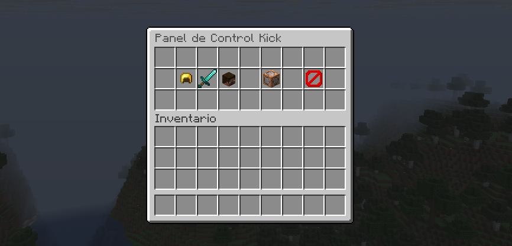

# KickChat Plugin


*Inserte aquí una captura del banner de inicio en la consola o un logo del proyecto.*

## Descripción
KickChat es un plugin avanzado para servidores de Minecraft (Spigot/Paper 1.21) que integra el chat de la plataforma de streaming Kick.com en tiempo real dentro del juego.

Más que un simple visualizador, KickChat actúa como una **suite de administración**, permitiendo moderar usuarios, reconocer roles (Subs/Mods), gestionar bots y recibir alertas de eventos, todo mediante una conexión directa por WebSockets (Pusher) para una latencia mínima.

## Características Principales

* **Sincronización en Tiempo Real:** Los mensajes del chat de Kick aparecen instantáneamente en Minecraft.
* **Panel de Control Maestro (GUI):** Nuevo inventario interactivo que clasifica automáticamente a los usuarios en carpetas (Suscriptores, Moderadores, Usuarios, Bots y Silenciados).
* **Reconocimiento de Roles:** Detecta e identifica visualmente a **Streamers**, **Moderadores**, **VIPs** y **Suscriptores** con colores y etiquetas personalizadas en el chat.
* **Sistema de Moderación:** Comandos para silenciar (`mute`) usuarios molestos y pausar el chat globalmente (`toggle`).
* **Sistema de Apelaciones:** Los usuarios silenciados pueden solicitar el desban usando el comando `!unban` desde Kick (con límite de intentos).
* **Resolución Automática de IDs:** El sistema detecta automáticamente los IDs necesarios (`chatroom` y `channel`) saltando protecciones básicas anti-bot.
* **Alertas de Seguidores:** Fuegos artificiales, sonidos y títulos en pantalla cuando ocurre un nuevo "Follow".
* **Soporte de Emotes:** Traducción automática de emotes de Kick a formato legible (`:emote:`) o emojis Unicode.

## Capturas de Pantalla

### Interfaz de Chat con Roles


*Vista de mensajes con prefijos de Streamer, Mod y Sub.* 

### Panel de Control Principal (GUI)

*Nuevo menú con categorías organizadas.*

## Instalación

1.  Descargue la última versión (`.jar`) de la sección de Releases.
2.  Coloque el archivo en la carpeta `plugins/` de su servidor.
3.  Reinicie el servidor.
4.  Configure el nombre del streamer en `config.yml` o use el comando `/kc setstreamer`.

## Comandos y Permisos

El comando principal es `/kickchat` (o el alias `/kc`). Todos los comandos requieren el permiso `kickchat.use`.

| Comando | Descripción |
| :--- | :--- |
| `/kc menu` | Abre el Panel de Control Maestro (GUI) para gestionar usuarios y bots. |
| `/kc setstreamer <nombre>` | Cambia el canal de Kick y reconecta automáticamente. |
| `/kc toggle` | Activa o desactiva la visibilidad del chat globalmente en el servidor. |
| `/kc mute <usuario>` | Silencia a un usuario específico de Kick para que no aparezca en Minecraft. |
| `/kc unmute <usuario>` | Quita el silencio a un usuario (soporta autocompletado). |
| `/kc reload` | Recarga la configuración desde el archivo `config.yml`. |
| `/kc start` | Fuerza un intento de reconexión manual. |

## Configuración (config.yml)

El archivo de configuración se genera automáticamente. **Nota:** No es necesario editar los IDs manualmente, el plugin lo hace solo.

```yaml
# Nombre del canal de Kick (slug de la URL)
streamer_name: "TheAndro2K"

# IDs internos (Auto-detectados, dejar en 0)
chatroom_id: 0
channel_id: 0

# --- CONFIGURACIÓN DE BOTS Y FILTROS ---
bot_settings:
  filter_enabled: true
  at_name_color: "&b" # Color para bots (@)
  
  # Bots silenciados (Se gestiona desde la GUI)
  blocked_list:
    - "Kicklet"

  # Bots conocidos (Se aprenden automáticamente)
  known_bots:
    - "Kicklet"
    - "BotRix"

# --- MODERACIÓN Y CONTROL ---
# Estado global del chat (visible/oculto)
chat_enabled: true

# Usuarios humanos silenciados manualmente
muted_users:
  - "UsuarioMolesto1"
```
## **Compilación (Desarrollo)**
Para compilar este proyecto desde el código fuente, es necesario tener instalado **Java 21 (JDK)** y **Maven**.

```Bash
git clone [https://github.com/Andro2k/KickChat.git](https://github.com/Andro2k/KickChat.git)
cd KickChat
mvn clean package
```
El archivo compilado se encontrará en la carpeta `target/`.

## **Tecnologías Utilizadas**
- **Java 21:** Lenguaje base.
- **Paper API 1.21:** API de servidor de Minecraft.
- **Pusher Java Client:** Conexión WebSocket con Kick.
- **Gson:** Procesamiento de datos JSON.
---
**Autor:** TheAndro2K
