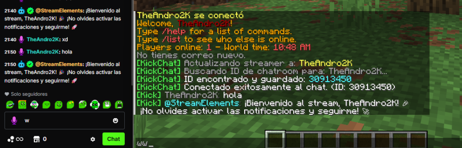
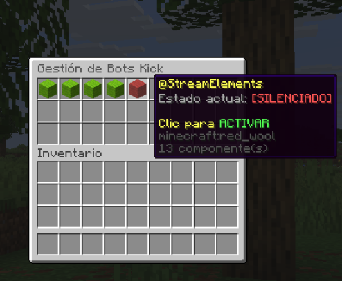

# KickChat Plugin


*Inserte aquí una captura del banner de inicio en la consola o un logo del proyecto.*

## Descripción
KickChat es un plugin avanzado para servidores de Minecraft (Spigot/Paper 1.21) que integra el chat de la plataforma de streaming Kick.com en tiempo real dentro del juego.

A diferencia de otras soluciones, este plugin utiliza conexión directa mediante WebSockets (Pusher) para una latencia mínima y cuenta con un sistema de resolución automática de IDs, eliminando la necesidad de configuración manual compleja.

## Características Principales

* **Sincronización en Tiempo Real:** Los mensajes del chat de Kick aparecen instantáneamente en el chat de Minecraft.
* **Gestión de Streamers:** Cambio dinámico de canal mediante comandos sin necesidad de reiniciar el servidor.
* **Resolución Automática de IDs:** El sistema detecta automáticamente el `chatroom_id` y `channel_id` utilizando la API pública de Kick.
* **Gestión Visual de Bots (GUI):** Interfaz de inventario para silenciar o activar bots conocidos con un solo clic.
* **Alertas de Seguidores:** Notificaciones globales, títulos en pantalla y efectos de fuegos artificiales cuando ocurre un nuevo "Follow".
* **Filtros de Spam y Colores:** Identificación visual de usuarios especiales (prefijo `@`) y listas negras configurables.
* **Soporte de Emotes:** Traducción automática de emotes de Kick a formato legible o emojis Unicode.

## Capturas de Pantalla

### Interfaz de Chat en el Juego


### Menú de Gestión de Bots (GUI)


<<<<<<< HEAD
=======
### Alerta de Nuevo Seguidor

>>>>>>> b34b5ee82caf33b3003e9960bdd6c4c4c54f6174

## Instalación

1.  Descargue la última versión (`.jar`) de la sección de Releases.
2.  Coloque el archivo en la carpeta `plugins/` de su servidor.
3.  Reinicie el servidor.
4.  Configure el nombre del streamer en `config.yml` o use el comando de configuración dentro del juego.

## Comandos y Permisos

El comando principal es `/kickchat` (o el alias `/kc`). Todos los comandos requieren el permiso `kickchat.use`.

| Comando | Descripción |
| :--- | :--- |
| `/kickchat setstreamer <nombre>` | Cambia el canal de Kick objetivo y reconecta automáticamente. |
| `/kickchat bots` | Abre el menú GUI para activar/desactivar la visualización de bots. |
| `/kickchat reload` | Recarga la configuración desde el archivo `config.yml`. |
| `/kickchat start` | Fuerza un intento de reconexión manual. |

## Configuración (config.yml)

El archivo de configuración se genera automáticamente. A continuación se detallan los parámetros principales:

```yaml
# Nombre del canal de Kick (slug de la URL)
streamer_name: "TheAndro2K"

# IDs internos (Se detectan automáticamente, no editar manualmente salvo error)
chatroom_id: 123456
channel_id: 987654

# Configuración de filtrado de Bots
bot_settings:
  filter_enabled: true
  # Color para nombres que inician con @
  at_name_color: "&b"
  
  # Lista de bots silenciados
  blocked_list:
    - "Kicklet"
    - "BotRix"

  # Bots detectados automáticamente por el sistema
  known_bots:
    - "Kicklet"
    - "Nightbot"
```
## **Compilación (Desarrollo)**
Para compilar este proyecto desde el código fuente, es necesario tener instalado **Java 21 (JDK)** y **Maven**.

```Bash
git clone [https://github.com/Andro2k/KickChat.git](https://github.com/Andro2k/KickChat.git)
cd KickChat
mvn clean package
```
El archivo compilado se encontrará en la carpeta `target/`.

## **Tecnologías Utilizadas**
- **Java 21:** Lenguaje base.
- **Paper API 1.21:** API de servidor de Minecraft.
- **Pusher Java Client:** Conexión WebSocket con Kick.
- **Gson:** Procesamiento de datos JSON.
---
**Autor:** TheAndro2K
